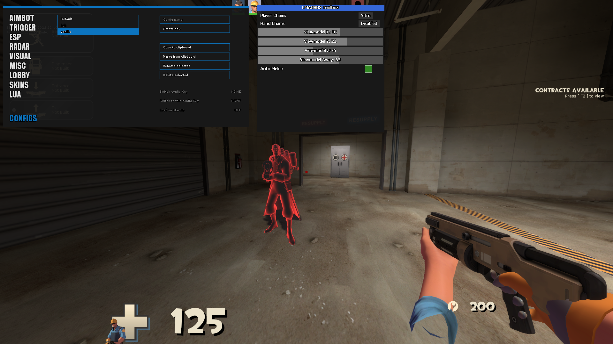
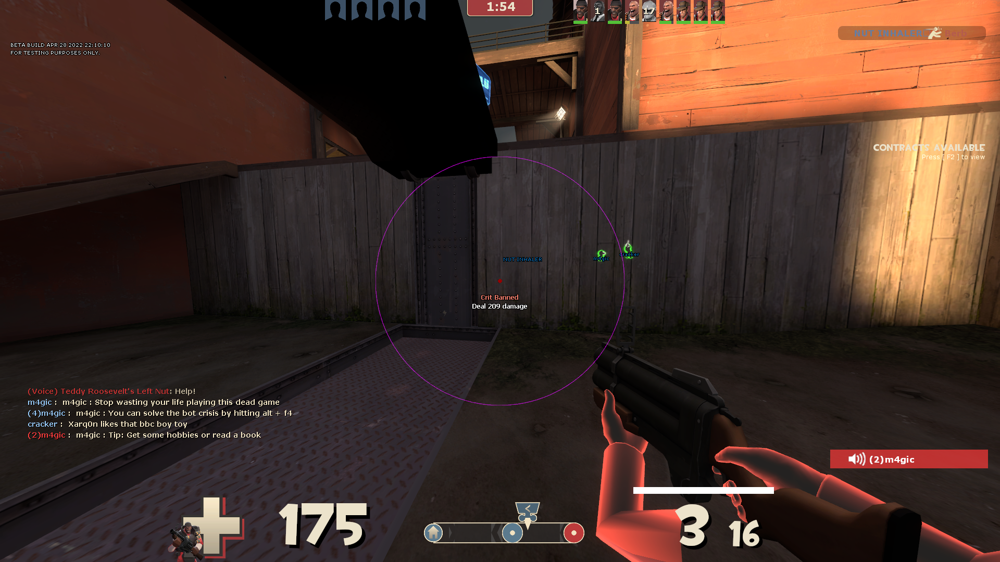

# LMAOBOX Toolbox LUA
A set of tools/features for lbox via the new LUA API. **WIP**  
Will be adding as much as we can think of/am capable of when we have the time to spare.   
Beware the menu code is a god awful mess for the time being.   
**WARNING**: While I haven't tested it, I believe using VM X/Y/Z/Sway can get you banned from some community servers as it doesn't do any cvar spoofing.

# Features
Plyr & Hand Chams - Nitro material is a replication of old Nitro chams (example: https://youtu.be/aLLKpvHxZBQ). Shine material is a version that's...shiny...  
VM X, Y, Z - Adjusts the viewmodel offset/position  
VM Sway - Uses cl_wpn_sway_interp to adjust weapon sway  
Auto Melee - Tempoarily removes your aimkey and enables autoshoot when your melee is out  

# Credits
### Direct Contributors
Callie/Kaylin - Lead  
ReD - Lead  

### Other
spook953  
Lak3  
LNX  
